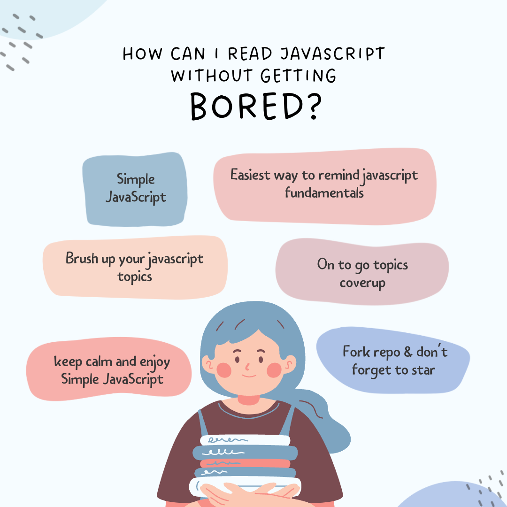

<div align="center">
[](https://github.com/signuldotdev/SimpleJavaScript/blob/main/README.md)	
	<h1>Duplicate this repo using notion</h1>

[](https://clover-ship-9de.notion.site/Getting-Started-JavaScript-Fundamentals-564d2ad42dd74ff38938a840934a02d6)

</div>
<br/>

## SimpleJavaScript to brush up your JavaScript skills

**JavaScript** (**JS**) is a lightweight, interpreted, or [just-in-time](https://en.wikipedia.org/wiki/Just-in-time_compilation) compiled programming language with [first-class functions](https://developer.mozilla.org/en-US/docs/Glossary/First-class_Function).JavaScript is a [prototype-based](https://developer.mozilla.org/en-US/docs/Glossary/Prototype-based_programming), multi-paradigm, single-threaded, dynamic language, supporting object-oriented, imperative, and declarative (e.g. functional
programming) styles.

## Table of Contents

# Getting Started ⇒ JavaScript Fundamentals

- [Getting Started ⇒ JavaScript Fundamentals](#getting-started--javascript-fundamentals)
  - [JavaScript Fundamentals => Part 1](#javascript-fundamentals--part-1)
  - [Hello World](#hello-world)
  - [A Brief Introduction Of JavaScript](#a-brief-introduction-of-javascript)
  - [Linking A JavaScript File](#linking-a-javascript-file)
  - [Values & Variables](#values--variables)
  - [Data Types](#data-types)
    - [The 7 Primitive Data Types](#the-7-primitive-data-types)
  - [Let, Const & Var](#let-const--var)
  - [Basic Operators](#basic-operators)
  - [Operator Precedence](#operator-precedence)
  - [String & Template literals](#string--template-literals)
  - [Taking Decisions: If / Else statements](#taking-decisions-if--else-statements)
  - [Type Conversion & Coercion](#type-conversion--coercion)
  - [Truthy & Falsy Values](#truthy--falsy-values)
  - [Equality Operator == vs ===](#equality-operator--vs-)
  - [Boolean Logic : The AND, OR & NOT Operators](#boolean-logic--the-and-or--not-operators)
  - [Logical Operators](#logical-operators)
  - [The Switch Statement](#the-switch-statement)
    - [Example](#example)
  - [Statements & Expressions](#statements--expressions)
  - [The Conditional (Ternary) Operator](#the-conditional-ternary-operator)
  - [JavaScript Release ES5, ES6+ & ESNext](#javascript-release-es5-es6--esnext)
- [JavaScript Fundamentals- Part 2](#javascript-fundamentals--part-2)
  - [Activating Strict Mode](#activating-strict-mode)
  - [Functions](#functions)
  - [Function Declarations & Expressions](#function-declarations--expressions)
  - [Arrow Functions](#arrow-functions)
  - [Functions Calling Other Functions](#functions-calling-other-functions)
  - [Introduction to Arrays](#introduction-to-arrays)
  - [Basic Arrays Operations Methods](#basic-arrays-operations-methods)
  - [Introduction to Objects](#introduction-to-objects)
  - [Dot vs Braket Notation](#dot-vs-braket-notation)
  - [Object Methods](#object-methods)
  - [Iteration: The For Loop](#iteration-the-for-loop)
  - [Looping Array, Breaking and Continuing](#looping-array-breaking-and-continuing)
  - [Looping Backwards and Loops in Loops](#looping-backwards-and-loops-in-loops)
  - [The While Loop](#the-while-loop)

---

## JavaScript Fundamentals => Part 1

---

## Hello World

In your browser, Open developer console and go to console bracket and run:

```jsx
alert('Hello World!!!');
// Hello World!!!

console.log('Hello World!!!');
// Hello World!!!

let javascript = 'awesome'
// undefined
if (javascript === 'awesome') alert('JavaScript is Awesome!!!')

JavaScript is Awesome!!!
```

```jsx
23 + 27 + 21;
71;

28 * 76;
2128;

2 % 10;
2;
```

## A Brief Introduction Of JavaScript

What is JavaScript?

- **`JavaScript is a high-level, object-oriented, multi-paradigm, programming language.`**
- Programming Language
  - Instruct Computer to do things
- Object-Oriented
  - Based on objects, for storing most kinds of data
- High-Level
  - We don't have to worry about complex stuff like memory management
- Multi-Paradigm
  - We can use different styles of programming

The Role of JavaScript in web development ?

- HTML

```jsx
NOUNS,
		<p></p>
means "paragraph"
```

- CSS

```jsx
ADJECTIVES,
		p { color: red}
means "the paragraph text is red"
```

- JS

```jsx
VERBS,
		p.hide();
means "hide the paragraph"
```

There is nothing you can't do with JavaScript (WELL, ALMOST...)

- Front-End
  - React
  - Angular
  - Vue
- Back-End
  - Node JS
- Native Mobile Application
  - React Native
  - Ionic
- Native Desktop Application
  - Electron

## Linking A JavaScript File

- Add JavaScript to `index.html` file,

```html
<body>
  <h1>JavaScript Fundamentals – Part 1</h1>

  <script src="script.js"></script>
</body>
```

- Run code on `script.js` file,

```jsx
let js = "amazing";
if (js === "amazing") alert("JavaScript is Awesome");

console.log(49 + 23 - 23 + 12);
```

```jsx
OUTPUT:

JavaScript is Awesome

CONSOLE:
61
```

## Values & Variables

<aside>
💡 `Variables` are containers for storing data (`values`).

</aside>

```jsx
let myCountry = "India";
let myContinent = "Asia";
let myPopulation = "1.36 Cr";

console.log(myCountry, myContinent, myPopulation);

// India Asia 1.36 Cr
```

## Data Types

In JS, every `value` is an `object` or `primitive` `Data` `Types`

- Object

```jsx
let me = {
  name: "Jonas",
};
```

- Primitive

```jsx
let firstName = "Jonas";
let age = 30;
```

### The 7 Primitive Data Types

1. `Number` : Floating point numbers 👉🏻 Used for decimals and integers

```jsx
let age = 23;
```

1. `String` : Sequence of Characters 👉🏻 Used for text

```jsx
let firstName = "Jonas";
```

1. `Boolean` : Logical type that can only be true or false 👉🏻 Used for taking decisions

```jsx
let fullAge = true;
```

1. `Undefined` : Value taken by a variable that is not yet defined('empty value')

```jsx
let children;
```

1. `Null` : Also means 'empty value'
2. `Symbol` (ES2015) : Value that is unique and cannot be changed [Not useful for now]
3. `BigInt` : (ES2020) : Larger integers than the Number type can hold

---

<aside>
💡 Commenting Code

</aside>

```jsx
// This is Single line comment
/* This is multi-line comment */
```

---

## Let, Const & Var

Let, Const & Var are the three different ways to declaring variables.

- `let` :

The `let` keyword was introduced in
[ES6 (2015)](https://www.w3schools.com/js/js_es6.asp).

Variables defined with `let` cannot be Redeclared.

Variables defined with `let` must be Declared before use.

Variables defined with `let` have Block Scope.

- `var` :

Variables are containers for storing data (values).

In this example, `x`, `y`, and `z`, are variables, declared with the `var` keyword:

```jsx
var x = 5;
var y = 6;
var z = x + y;

// 11
```

- `const` :

The `const` keyword was introduced in
[ES6 (2015)](https://www.w3schools.com/js/js_es6.asp).

Variables defined with `const` cannot be Redeclared.

Variables defined with `const` cannot be Reassigned.

Variables defined with `const` have Block Scope.

```jsx
const PI = 3.141592653589793;
PI = 3.14; // This will give an error
PI = PI + 10; // This will also give an error

// TypeError: invalid assignment to const 'PI'
```

## Basic Operators

```jsx
const now = 2021;
const ageVinit = now - 1996;
const ageSanket = now - 2000;
console.log(ageVinit, ageSanket);

// 25 21

console.log(ageVinit * 2, ageSanket + 2 * 2);

// 25, 50

const firstName = "Sanket";
const lastName = "Sangha";
console.log(firstName + " " + lastName);

// Sanket Sangha
```

## Operator Precedence

[Operator precedence](https://developer.mozilla.org/en-US/docs/Web/JavaScript/Reference/Operators/Operator_Precedence)` determines how operators are parsed concerning each other. Operators with higher precedence become the operands of operators with lower precedence.`

## String & Template literals

`**String` 👇🏻\*\*

<aside>
💡 Old Trick

</aside>

```jsx
const firstName = "Sanket";
const job = "teacher";
const birthYear = 2000;
const year = 2021;

const sanket =
  "I'm " + firstName + ", a " + (year - birthYear) + " years old " + job + "!";
console.log(sanket);

// I'm Sanket, a 21 years old teacher!
```

`**Template literals 👇🏻**`

_Template Literals use back-ticks (``) rather than the quotes ("") to define a string._

<aside>
💡 New Trick

</aside>

```jsx
const firstName = "Sanket";
const job = "teacher";
const birthYear = 2000;
const year = 2021;

const newSanket = `I'm ${firstName}, a ${year - birthYear} 
year old ${job}!`;
console.log(newSanket);

// I'm Sanket, a 21 year old teacher!
```

## Taking Decisions: If / Else statements

`Example 1:`

```jsx
const age = 19; or const age = 15;

if (age >= 18) {
    console.log('Sanket can start driving license 🚗');
//  Sanket can start driving license 🚗
} else {
    const yearsLeft = 18 - age;
    console.log(`Sanket is too young. Wait another ${yearsLeft} years :)`);
}
// Sanket is too young. Wait another 3 years :)
```

`Example 2:`

```jsx
const year = 2021;

let birthYear;
if (birthYear <= 2000) {
  century = 20;
} else {
  century = 21;
}

console.log(century);

// 21
```

## Type Conversion & Coercion

`**Type Conversion` 👇🏻\*\*

JavaScript variables can be converted to a new variable and another data type:

- By the use of a JavaScript function
- **Automatically** by JavaScript itself

```jsx
// Type conversion
const inputYear = 2000;
console.log(Number(inputYear), inputYear);
console.log(Number(inputYear) + 18);

console.log(Number('Sanket'));
console.log(typeof NaN);

console.log(String(23), 23);

// OUTPUT:
2000 2000
2018
NaN
number
23 23
```

`**Type Coercion 👇🏻**`

Type Coercion refers **to the process of automatic or implicit conversion of values from one data type to another**.

```jsx
// Type Coercion
console.log('I am ' + 23 + ' year old');
console.log('23' - '10' - 3);
console.log('23' * '2');
console.log('23' > '18');

// OUTPUT:
I am 23 year old
10
46
true
```

## Truthy & Falsy Values

Truthy -> Value that resolve to true in boolean context

Falsy -> Value that resolve to false in boolean context

**List of falsy values in JavaScript:**[From MDN](https://developer.mozilla.org/en-US/docs/Glossary/Falsy)

1. `false`
2. `null`
3. `undefined`
4. `0`
5. `NaN`
6. `''`, `""`, ````(Empty template string)
7. `document.all`
8. `0n`: BigInt
9. `0`

## Equality Operator == vs ===

The `equality operator == does type coercion,` meaning that the interpreter implicitly tries to convert the values before comparing.

The `identity operator === does not do type coercion,` and thus does not convert the values when comparing, and is therefore faster as it skips one step.

## Boolean Logic : The AND, OR & NOT Operators

A JavaScript Boolean represents one of two values: `true` or `false`.

`**Boolean Values**`

Very often, in programming, you will need a data type that can only have one
of two values, like

- YES / NO
- ON / OFF
- TRUE / FALSE

For this, JavaScript has a **Boolean** data type. It can only
take the values **true** or **false**.

## Logical Operators

[Logical operators](https://javascript.info/logical-operators) are used to determine the logic between variables or values.

## The Switch Statement

> The switch statement is used to perform different actions based on different conditions.

> **`Syntax:`**

```jsx
switch (expression) {
  case x:
    // code block
    break;
  case y:
    // code block
    break;
  default:
  // code block
}
```

### Example

The `getDay()` method returns the weekday as a number between
0 and 6.

(Sunday=0, Monday=1, Tuesday=2 ..)

This example uses the weekday number to calculate the weekday name:

```jsx
switch (new Date().getDay()) {
  case 0:
    day = "Sunday";
    break;
  case 1:
    day = "Monday";
    break;
  case 2:
    day = "Tuesday";
    break;
  case 3:
    day = "Wednesday";
    break;
  case 4:
    day = "Thursday";
    break;
  case 5:
    day = "Friday";
    break;
  case 6:
    day = "Saturday";
}

// Saturday
```

## Statements & Expressions

- `**Statement`👇🏻\*\*

> JavaScript statement are composed of:

> Values, Operators, Expressions, Keywords, and Comments.

```jsx
// This statement tells the browser to write "Hello Dolly." inside an HTML element with id="demo":

document.getElementById("demo").innerHTML = "Hello Dolly.";
```

- `**Expression 👇🏻**`

> An expression is a snippet of code that evaluates to a value.

```jsx
// The below code snippets are all expressions. They all evaluate to a value.

0; // 0

1 + 1; // 2

"Hello" + " " + "World"; // 'Hello World'

{
  answer: 42;
} // { answer: 42 }

Object.assign({}, { answer: 42 }); // { answer: 42 }

answer !== 42 ? 42 : answer; // 42

answer = 42; // 42
```

## The Conditional (Ternary) Operator

> The conditional (ternary) operator is the only JavaScript operator that takes three operands: a condition followed by a question mark (?), then an expression to execute if the condition is `truthy` followed by a colon (:), and finally the expression to execute if the condition is `falsy`. This operator is frequently used as a shortcut for the if statement.

```jsx
function getFee(isMember) {
  return isMember ? "$2.00" : "$10.00";
}

console.log(getFee(true));
// expected output: "$2.00"

console.log(getFee(false));
// expected output: "$10.00"

console.log(getFee(null));
// expected output: "$10.00"
```

## JavaScript Release ES5, ES6+ & ESNext

> A Brief History of JavaScript

- 1995 👉🏻 Brendan Eich very first version of javascript in just 10 days.
- 1996 👉🏻 JavaScript has almost nothing to do with Java.
- 1997 👉🏻 Official Standard for JavaScript
- 2009👉🏻 ES5 (ECMAScript 5) is released with lots of great new features.
- 2015👉🏻 ES6/ES2015 was released the biggest update to the language ever!
- 2016 - | 👉🏻 Release of ES2016/ES2017/ES2018/ES2019/ES2020/ES2021/ .../ ES2089 😂

> Backwards Compatibility: Don't Break the Web!

- Backwards Compatibility
- Old features are never removed;
- Not really new versions, just incremental updates(releases)
- Websites keep working forever!

> How to use Modern JavaScript Today

- During development 👉🏻 Simply use the latest Google Chrome!
- During production 👉🏻 Use Babel to transpile and polyfill your code (converting back to ES5 to ensure browser compatibility for all users).

---

# JavaScript Fundamentals- Part 2

---

## Activating Strict Mode

> `"use strict";` Defines that
> JavaScript code should be executed in
> "strict mode".

- Always use strict mode on top of code.

```jsx
"use strict";
```

## Functions

A [JavaScript function](#https://developer.mozilla.org/en-US/docs/Web/JavaScript/Guide/Functions) is a block of code designed to perform a particular task.
A JavaScript function is executed when "something" invokes it (calls it).

```jsx
function Apple() {
  console.log("iphone is Apple Inc. Product");
}

Apple();
```

## Function Declarations & Expressions

The [function declaration](#https://medium.com/@mandeep1012/function-declarations-vs-function-expressions-b43646042052) (function statement) defines a function with the specified parameters.

```jsx
// Fuction Declaration
function CalcAge1(birthYear) {
  return 2037 - birthYear;
}
const age1 = calcAge1(1991);

// Function Expression
const calcAge2 = function (birthYear) {
  return 2037 - birthYear;
};
const age2 = calcAge2(1991);

console.log(age1, age2);

// 46 46
```

## Arrow Functions

An [arrow function](#https://www.codecademy.com/resources/docs/javascript/arrow-functions) expression has a shorter syntax when compared to a function expression and does not have its own this, arguments, super or new.target. These function expressions are best applied to functions other than methods, and they cannot be used as constructors.

```jsx
// Arrow Function
const calcAge3 = (birthYear) => 37 - birthYear;
const age3 = calcAge3(1991);
console.log(age3);

const yearsUntilRetirement = (birthYear, firstName) => {
  const age = 2037 - birthYear;
  const retirement = 65 - age;

  //return retirement;
  return `${firstName} restires in ${retirement} years`;
};
console.log(yearsUntilRetirement(1991, "John"));
conosle.log(yearsUntilRetirement(1980, "Jacob"));

// 46
// John retires in 19 years
// Jacob retires in 8 years
```

## Functions Calling Other Functions

To [call a function inside another function](#https://bobbyhadz.com/blog/javascript-call-function-inside-function), define the inner function inside the outer function and invoke it. When using the function keyword, the function gets hoisted to the top of the scope and can access any of the available variables in the scope.

```jsx
function cutFruitPieces(fruit) {
  return fruit * 4;
}

function fruitProcessor(apples, oranges) {
  const applePieces = cutFruitPieces(apples);
  const orangePieces = cutFruitPieces(oranges);

  const juice = `Juice with ${applePieces} apples and ${orangePieces} oranges`;
  return juice;
}
console.log(fruitProcessor(2, 3));

// Juice with 8 apples and 12 oranges
```

## Introduction to Arrays

An [array](#https://attacomsian.com/blog/javascript-arrays) is a list-like object in JavaScript that can be used to store multiple values in a single variable. It is an ordered-collection of values where each value is called an element that has a pre-defined numeric position in the array, referred to as its index.

```jsx
const fruits = ["apple", "orange", "banana"];
console.log(fruits);

const years = [1991, 1992, 1993];
console.log(years[1]);

console.log(fruits.length);
console.log(fruits[fruits - length - 1]);

// ["apple", "orange", "banana"]
// 1992
// 3
// 3
```

## Basic Arrays Operations Methods

[JavaScript Array Methods Tutorial – The Most Useful Methods Explained with Examples](#https://www.geeksforgeeks.org/javascript-basic-array-methods/)

```jsx
console.log(newLength);

fruits.unshift("grape");
console.log(fruits);

// Remove Elements
fruits.pop(); // Last Element
const popped = fruits.pop();
console.log(popped);
console.log(fruits);

fruits.shift(); // First Element
console.log(fruits);

console.log(fruits.indexOf("orange"));
console.log(fruits.indexOf("watermelon"));

fruits.push(23);
console.log(fruits.includes("orange"));
console.log(fruits.includes("watermelon"));
console.log(fruits.includes(23));

if (fruits.includes("orange")) {
  console.log("You have a friend called orange");
}

// Output

// [ 'apple', 'orange', 'banana', 'mango' ]
// 4

// 5
// [ 'grape', 'apple', 'orange', 'banana', 'mango' ]

// 'mango'

// 'banana'
// [ 'grape', 'apple', 'orange' ]

// 'grape'
// [ 'apple', 'orange' ]

// 1
// -1

// 3
// true
// false
// true

// 'You have a friend called orange'

//
```

## Introduction to Objects

In JavaScript, most things are [objects](#https://developer.mozilla.org/en-US/docs/Learn/JavaScript/Objects), from core JavaScript features like arrays to the browser APIs built on top of JavaScript. You can even create your own objects to encapsulate related functions and variables into efficient packages and act as handy data containers. The object-based nature of JavaScript is important to understand if you want to go further with your knowledge of the language, therefore we've provided this module to help you. Here we teach object theory and syntax in detail, then look at how to create your own objects.

```jsx
const johnArray = [
  'John',
  'Smith',
  2037 - 1991,
  'teacher',
  ['apple', 'orange', 'banana']
];

const john = [
  firstName: 'John',
  lastName: 'Smith',
  age: 2037 - 1991,
  job: 'teacher',
  favoriteFruit: ['apple', 'orange', 'banana']
]


```

## Dot vs Braket Notation

Property accessors provide access to an object's properties by using the [dot notation or the bracket notation](#https://developer.mozilla.org/en-US/docs/Web/JavaScript/Reference/Operators/Property_Accessors).

```jsx
const john = {
  firstName: "John",
  lastName: "Smith",
  age: 2037 - 1991,
  job: "teacher",
  favoriteFruit: ["apple", "orange", "banana"],
};
console.log(john);

console.log(john.lastName);
console.log(john["lastName"]);

const namekey = "Name";
console.log(john["first" + nameKey]);
console.log(john["last" + nameKey]);

const intrestedIn = prompt(
  "What do you want to know about John? Choose between firstName, lastName, age, job and favoriteFruit"
);

if (jonas[intrestedIn]) {
  console.log(jonas[intrestedIn]);
} else {
  console.log(
    "Wrong request! Choose between firstName, lastName, age, job and favoriteFruit"
  );
}

john.location = "USA";
john.twitter = "@johnsmith";
console.log(john);

// {
//   firstName: 'John',
//   lastName: 'Smith',
//   age: 27,
//   job: 'teacher',
//   favoriteFruit: [ 'apple', 'orange', 'banana' ]
// }

// 'Smith'
// 'Smith'
// 'John'
// 'Smith'

// Object { firstName: "John", lastName: "Smith", age: 46, job: "teacher", favoriteFruit: (3) […] }
// ​
// age: 46
// ​
// favoriteFruit: Array(3) [ "apple", "orange", "banana" ]
// ​
// firstName: "John"
// ​
// job: "teacher"
// ​
// lastName: "Smith"
```

## Object Methods

[Object Methods](#https://javascript.info/object-methods) in JavaScript can be accessed by using functions. Functions in JavaScript are stored as property values. The objects can also be called without using bracket ().

```jsx
const john = {
  firstName: "John",
  lastName: "Smith",
  birthYear: 1991,
  job: "teacher",
  favoriteFruit: ["apple", "orange", "banana"],
  hasDrivingLicense: true,

  calcAge: function () {
    console.log(this);
    return 2037 - this.birthYear;
  },

  getSummary: function () {
    return `${this.firstName} is a ${this.calcAge()} -years old ${
      john.job
    }, and he has ${this.hasDriverLicense ? "a" : "no"} driver license`;
  },
};

console.log(john.calcAge());
console.log(john.getSummary());

// {
//   firstName: 'John',
//   lastName: 'Smith',
//   birthYear: 1991,
//   job: 'teacher',
//   favoriteFruit: [ 'apple', 'orange', 'banana' ],
//   hasDrivingLicense: true,
//   calcAge: ƒ calcAge(),
//   getSummary: ƒ getSummary()
// }
// {
//   firstName: 'John',
//   lastName: 'Smith',
//   birthYear: 1991,
//   job: 'teacher',
//   favoriteFruit: [ 'apple', 'orange', 'banana' ],
//   hasDrivingLicense: true,
//   calcAge: ƒ calcAge(),
//   getSummary: ƒ getSummary()
// }
// 46
// 'John is a 46 -years old teacher, and he has no driver license'
```

## Iteration: The For Loop

[Loops](#https://www.freecodecamp.org/news/exploring-javascript-for-in-loops-bdfc226d8515/) allow programs to perform repetitive tasks, such as iterating through an array, while adhering to the DRY principle (Don’t Repeat Yourself). They come in handy when you want to execute a function a number of times, using different sets of inputs each time.

> [Iterate with JavaScript For Loops](#https://www.freecodecamp.org/learn/javascript-algorithms-and-data-structures/basic-javascript/iterate-with-javascript-for-loops)

```jsx
for (let rep = 1; rep <= 30; rep++) {
  console.log(`Lifting weights repetition ${rep}🏋🏻‍♀️`);
}

// 'Lifting weights repetition 1🏋🏻‍♀️'
// 'Lifting weights repetition 2🏋🏻‍♀️'
// 'Lifting weights repetition 3🏋🏻‍♀️'
// 'Lifting weights repetition 4🏋🏻‍♀️'
// 'Lifting weights repetition 5🏋🏻‍♀️'
// 'Lifting weights repetition 6🏋🏻‍♀️'
// 'Lifting weights repetition 7🏋🏻‍♀️'
// 'Lifting weights repetition 8🏋🏻‍♀️'
// 'Lifting weights repetition 9🏋🏻‍♀️'
// 'Lifting weights repetition 10🏋🏻‍♀️'
// 'Lifting weights repetition 11🏋🏻‍♀️'
// 'Lifting weights repetition 12🏋🏻‍♀️'
// 'Lifting weights repetition 13🏋🏻‍♀️'
// 'Lifting weights repetition 14🏋🏻‍♀️'
// 'Lifting weights repetition 15🏋🏻‍♀️'
// 'Lifting weights repetition 16🏋🏻‍♀️'
// 'Lifting weights repetition 17🏋🏻‍♀️'
// 'Lifting weights repetition 18🏋🏻‍♀️'
// 'Lifting weights repetition 19🏋🏻‍♀️'
// 'Lifting weights repetition 20🏋🏻‍♀️'
// 'Lifting weights repetition 21🏋🏻‍♀️'
// 'Lifting weights repetition 22🏋🏻‍♀️'
// 'Lifting weights repetition 23🏋🏻‍♀️'
// 'Lifting weights repetition 24🏋🏻‍♀️'
// 'Lifting weights repetition 25🏋🏻‍♀️'
// 'Lifting weights repetition 26🏋🏻‍♀️'
// 'Lifting weights repetition 27🏋🏻‍♀️'
// 'Lifting weights repetition 28🏋🏻‍♀️'
// 'Lifting weights repetition 29🏋🏻‍♀️'
// 'Lifting weights repetition 30🏋🏻‍♀️'
```

## Looping Array, Breaking and Continuing

> [Looping Array](#https://www.w3docs.com/snippets/javascript/how-to-loop-through-an-array-in-javascript.html) ➡
> Loops offer a quick and easy way to do something repeatedly.

> [Breaking](#https://developer.mozilla.org/en-US/docs/Web/JavaScript/Reference/Statements/break) ➡
> The break statement terminates the current loop, switch, or label statement and transfers program control to the statement following the terminated statement.

> [Continuing](#https://developer.mozilla.org/en-US/docs/Web/JavaScript/Reference/Statements/continue) ➡
> The continue statement terminates execution of the statements in the current iteration of the current or labeled loop, and continues execution of the loop with the next iteration.

```jsx
const john = [
  "John",
  "Smith",
  "2037 - 1991",
  "teacher",
  ["apple", "orange", "banana"],
];
const types = [];

for (let i = 0; i < john.length; i++) {
  console.log(john[i], typeof john[i]);
  // Reading from john array
  types[i] = typeof john[i];
}

console.log(types);

const years = [1991, 2007, 1969, 2020];
const ages = [];

for (let i = 0; i < years.length; i++) {
  // Filling types array
  ages.push(2037 - years[i]);
}

console.log(ages);

// continue and break
console.log("--- ONLY STRINGS ---");
for (let i = 0; i < john.length; i++) {
  if (typeof john[i] !== "string") continue;

  console.log(john[i], typeof john[i]);
}

console.log("--- BREAK WITH NUMBER ---");
for (let i = 0; i < john.length; i++) {
  if (typeof john[i] === "number") break;

  console.log(john[i], typeof john[i]);
}

// 'John' 'string'
// 'Smith' 'string'
// '2037 - 1991' 'string'
// 'teacher' 'string'
// 'object'
// [ 'apple', 'orange', 'banana' ] 'object'
// [ 'string', 'string', 'string', 'string', 'object' ]

// 4

// [ 46, 30, 68, 17 ]

// '--- ONLY STRINGS ---'

// 'John' 'string'
// 'Smith' 'string'
// '2037 - 1991' 'string'
// '--- BREAK WITH NUMBER ---'
// 'teacher' 'string'

// 'John' 'string'
// 'Smith' 'string'
// '2037 - 1991' 'string'
// 'teacher' 'string'
// [ 'apple', 'orange', 'banana' ] 'object'
```

## [Looping Backwards and Loops in Loops](#https://www.techiedelight.com/loop-through-array-backwards-javascript/)

```jsx
const john = [
  "John",
  "Smith",
  "2037 - 1991",
  "teacher",
  ["apple", "orange", "banana"],
];

for (let i = john.length - 1; i >= 0; i--) {
  console.log(i, john[i]);
}

for (let exercise = 1; exercise < 4; exercise++) {
  console.log(`--------- Starting exercise ${exercise} --------`);

  for (let rep = 1; rep < 6; rep++) {
    console.log(`Exercise ${exercise}: Lifting weight repetition ${rep}🏋🏻‍♀️`);
  }
}

// 4 [ 'apple', 'orange', 'banana' ]
// 3 'teacher'
// 2 '2037 - 1991'
// 1 'Smith'
// '--------- Starting exercise 1 --------'
// 0 'John'
// '--------- Starting exercise 2 --------'
// 'Exercise 1: Lifting weight repetition 1🏋🏻‍♀️'
// 'Exercise 1: Lifting weight repetition 2🏋🏻‍♀️'
// 'Exercise 1: Lifting weight repetition 3🏋🏻‍♀️'
// 'Exercise 1: Lifting weight repetition 4🏋🏻‍♀️'
// 'Exercise 1: Lifting weight repetition 5🏋🏻‍♀️'
// 'Exercise 2: Lifting weight repetition 1🏋🏻‍♀️'
// 'Exercise 2: Lifting weight repetition 2🏋🏻‍♀️'
// 'Exercise 2: Lifting weight repetition 3🏋🏻‍♀️'
// 'Exercise 2: Lifting weight repetition 4🏋🏻‍♀️'
// 'Exercise 2: Lifting weight repetition 5🏋🏻‍♀️'
// '--------- Starting exercise 3 --------'
// 'Exercise 3: Lifting weight repetition 1🏋🏻‍♀️'
// 'Exercise 3: Lifting weight repetition 2🏋🏻‍♀️'
// 'Exercise 3: Lifting weight repetition 3🏋🏻‍♀️'
// 'Exercise 3: Lifting weight repetition 4🏋🏻‍♀️'
// 'Exercise 3: Lifting weight repetition 5🏋🏻‍♀️'
```

## The While Loop

The [while](#https://developer.mozilla.org/en-US/docs/Web/JavaScript/Reference/Statements/while) statement creates a loop that executes a specified statement as long as the test condition evaluates to true. The condition is evaluated before executing the statement.

```jsx
for (let rep = 1; rep <= 10; rep++) {
  console.log(`Lifting weights repetition ${rep}🏋🏻‍♀️`);
}

let rep = 1;
while (rep <= 10) {
  console.log(`Lifting weights repetition ${rep}🏋🏻‍♀️`);
  rep++;
}

// 'Lifting weights repetition 1🏋🏻‍♀️'
// 'Lifting weights repetition 2🏋🏻‍♀️'
// 'Lifting weights repetition 3🏋🏻‍♀️'
// 'Lifting weights repetition 4🏋🏻‍♀️'
// 'Lifting weights repetition 5🏋🏻‍♀️'
// 'Lifting weights repetition 1🏋🏻‍♀️'
// 'Lifting weights repetition 6🏋🏻‍♀️'
// 10
// 'Lifting weights repetition 7🏋🏻‍♀️'
// 'Lifting weights repetition 8🏋🏻‍♀️'
// 'Lifting weights repetition 9🏋🏻‍♀️'
// 'Lifting weights repetition 10🏋🏻‍♀️'
// 'Lifting weights repetition 2🏋🏻‍♀️'
// 'Lifting weights repetition 3🏋🏻‍♀️'
// 'Lifting weights repetition 4🏋🏻‍♀️'
// 'Lifting weights repetition 5🏋🏻‍♀️'
// 'Lifting weights repetition 6🏋🏻‍♀️'
// 'Lifting weights repetition 7🏋🏻‍♀️'
// 'Lifting weights repetition 8🏋🏻‍♀️'
// 'Lifting weights repetition 9🏋🏻‍♀️'
// 'Lifting weights repetition 10🏋🏻‍♀️'

let rep = 1;
while (rep <= 10) {
  rep++;
}

let dice = Math.trunc(Math.random() * 6) + 1;

while (dice !== 6) {
  console.log(`Rolling dice ${dice}🎲`);
  dice = Math.trunc(Math.random() * 6) + 1;
  if (dice === 6) console.log("Loop is about to end...");
}

// 10
```
